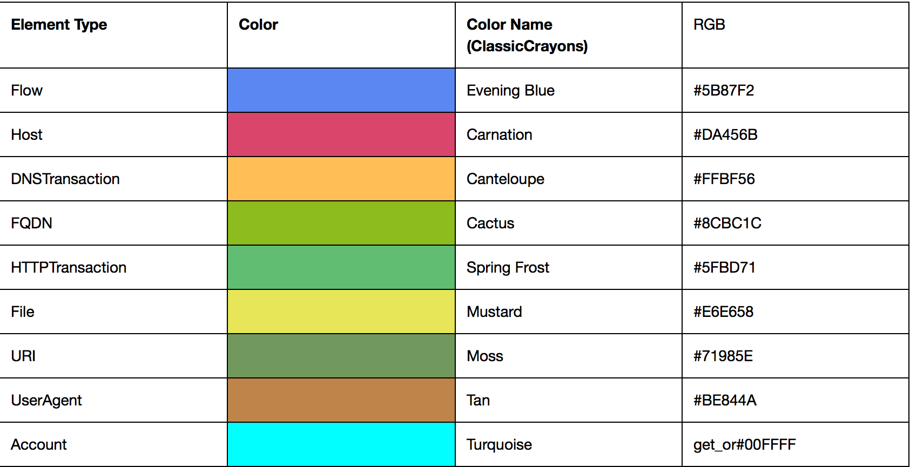
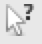
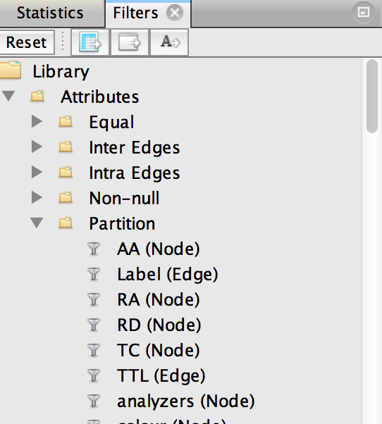
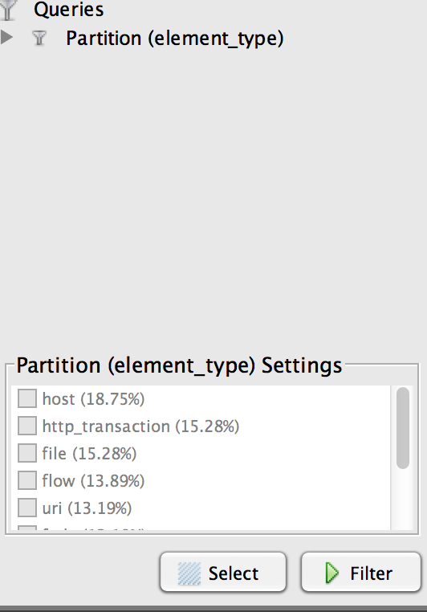

# Bro2Graph

## Prerequisites
Bro2Graph relies on a few third-party packages, namely the Rexster server (https://github.com/tinkerpop/rexster/wiki/Downloads) and the 'Bulbs' Python interface (http://bulbflow.com).  

To render and interact with the graph, you'll need to install Gephi (http://gephi.github.io).  You'll also need the "Give Colors to Nodes" and "Graph Streaming" plugins (see the *Tools -> Plugins -> Available Plugins* menu to download and install these from within Gephi).

### Installing & Configuring Rexster
Installation is the very simple.  Just download the latest version of the Rexster Server package from the above URL.  At the time of this writing, that would be v2.6.0.  It's all one big Zip file, so just extract it somewhere convenient.  

Once unzipped, you will need to edit the _config/rexster.xml_ file to create the database used by our scripts.  Find the beginning of the `<graphs>` stanza (where, obviously, all the graphs are defined) and insert the following:

	<graph>                                                                 
	 <graph-name>hunting</graph-name>
	 <graph-type>tinkergraph</graph-type>                                
	 <graph-mock-tx>true</graph-mock-tx>                                 
         <extensions>                                                        
             <allows>                                                        
                 <allow>tp:gremlin</allow>                                   
             </allows>                                                       
         </extensions>                                                       
    </graph>                                                                

### Installing Bulbs
Bulbs is available through PyPi, so you can install it quite easily:

	# pip install bulbs

## Getting Data Into the Graph
To load Bro data into the graph, you must first start the graph database backend.  After that, you simply run the script to load your Bro log files into that database.  This section details the process.

### Starting the Graph Database Backend
When you begin your hunting session, the first thing you'll need to do is to start the graph database backend, like so:

	[...]/rexster-server-2.6.0> ./bin/rexster.sh --start
	
You'll get a lot of output, but after a few seconds, the database will be initialized and ready for action.

### Loading Bro Data Into the Graph

	[...]/Bro2Graph> ./db-load.py -l ~/BroLogDir
	
This should go pretty quickly for smaller datasets, but if you have a lot of Bro logs, it could take quite a long time.  Hours, even, for larger datasets.

When it's finished, you'll see something like the following:

	[...]/Bro2Graph> ./db_load.py -l ~/BroLogDir
	Reading log files from /Users/bro/BroLogDir
	Graphing Flows...
	Reading /Users/bro/BroLogDir/conn.log...
	Number of events: 18
	Graphing Files...
	Reading /Users/bro/BroLogDir/files.log...
	Number of events: 22
	Graphing DNS Transactions...
	Reading /Users/bro/BroLogDir/dns.log...
	Number of events: 11
	Graphing HTTP Transactions...
	Reading /Users/bro/BroLogDir/http.log...
	Number of events: 22
	
	**** Graph Stats
	
	  **** Totals
	         Vertices	144
	            Edges	414
	
	  **** Vertices by type:
	          account	2
	             flow	20
	             fqdn	19
	              uri	19
	             host	27
	   dnsTransaction	11
	             file	22
	        userAgent	2
	  http_transaction	22
	
	  **** Edges by type:
	          queried	11
	         received	21
	         hostedBy	22
	         contains	55
	        requested	2
	             dest	18
	         resolved	11
	       resolvedTo	32
	    queriedServer	11
	      connectedTo	14
	            agent	44
	     identifiedBy	22
	           source	18
	             uses	2
	           answer	32
	           sentTo	22
	           sentBy	22
	      requestedBy	22
	         lookedUp	11
	      requestedOf	22

Notice that the last part is a summary of the numbers and types of nodes and edges in the graph.  You can generate this report at any time by running the *db_stats.py* script.

### Deleting the Graph
If for any reason you want to delete all the loaded data and start fresh, you have two options.  The default Rexster configuration (above) only stores the data in RAM, so simply restarting Rexster will effectively erase all the data.  

On the other hand, if you have configured Rexster to save the data to disk, or if you just don't feel like restarting the database process, you can run *db_clear.py*.  After confirming that you do indeed really want to delete everything, the script will do just that.  At the end, you'll have a fresh new database, just as though you had never loaded anything into it.

## Visualizing the Graph
After you have loaded your Bro data into the graph, you will naturally want to see what this looks like.  In this section, you'll learn how to start Gephi, load the data in, and do some simple things to render the graph in a more readable fashion.  

Note that Gephis is a **very** full featured system for interacting and computing with graphs.  This document will barely scratch the surface of what you can do with Gephi, and I encourage you to come up with your own cool techniques (and to share them!).

### Loading the Data Into Gephi
Start Gephi, and select "New Project" when prompted. This will give you a blank workspace (Gephi calls them "canvases").  

If you have already installed the necessary plugins, you should see a tab on the lefthand column called *Streaming*.  Click that, and then right click on the *Master Server* entry and set it to *Start*.  This makes Gephi listen on the local network for graph streaming connections.  

Now that Gephi is listening for graph data, run *db_graph.py* to send the data from Rexster into Gephi.  There are no arguments necessary, as it will just stream the entire graph.  This shouldn't take too long, and the output is minimal.  If you look at the Gephi window, you'll see a bunch of black lines and dots.  Don't worry, we'll make this look a lot better!

Once you've loaded the data, click back over to Gephi's *Layout* tab, since we'll need that later. 

### Making the Graph Readable

To make this graph something approaching readable, we'll start with three simple operations:

* Assign colors to the different types of nodes
* Size the nodes according to some criteria
* Apply a layout algorithm

#### Node Colors
The *db_load.py* script automatically assigned color values to different types of nodes when it loaded them into the database.  Each type of node is color coded, according to the chart below.

By default, though, Gephi will not display these colors.  The *Give Colors to Nodes* plugin you installed earlier makes this quite simple, though.  Simply click on the plugin's icon to the left of the canvas.  It looks like this:

This will automatically color the nodes according to their type, though you may not immediately notice this since most of the nodes are still quite small.

#### Resize the Nodes
When working with graphs, it's very common to want to display the nodes as different sizes, depending on some criteria you compute.  This gives you some immediate visual feedback about the nodes, and is quite useful.

You can size your nodes by any numeric feature that Bro computed (for example, by the number of bytes transferred, if you are looking at network Flow nodes).  However, the most common way is probably to size them by the number of edges they have with other nodes.  The edge count of a node is referred to as it's *degree*.  We'll start with this.

To resize your nodes, simply click the *Ranking* tab on the left side of the Gephi screen.  The drop down menu at the top of the ranking panel lists all of the criteria you can use to size your nodes.  Some are computations that Gephi performs for you (like degree), while others are fields drawn from your own data.  For now, though, select *Degree* and click *Apply*.  

Now you should start seeing nodes of various sizes, and you can probably also start to see their colors as well.  Still, it's a bit of a mess, so let's fix that.

#### Applying a Layout Algorithm
By default, Gephi displays your graph in a pretty jumbled, hard to understand fashion.  You can easily fix this by applying a layout algorithm from the *Layout* panel on the left.  

Gephi comes with a number of predefined layout algorithms, and I'm not going to try to explain them in detail.  Most of these are well-known algorithms (at least, if you are a computer scientist who deals with graphs a lot, I guess) and you can Google them if you want to know how they work. 

For now, though, select the *Yifan Hu* algorithm from the drop down and click *Run*.  You should see the nodes on your graph start to move around as the algorithm does its work.  Yifan Hu will automatically stop when it thinks it's got everything right, but sometimes running it more than once may help make the graph clearer, with more separation between the clusters of nodes.

## Interacting With the Graph
Now that your graph is formatted nicely, you can start to explore it.  Gephi has **a lot** of nice functions for this, and I am not going to try to cover them all here.  I recommend searching for "Gephi" on YouTube to find some really nice tutorials.  

For now, though, I want to show just two things: How to inspect the values for a specific node, and how to control which types of nodes and/or relationships you show on the graph. 

### Inspecting the Values of a Node
This is actually pretty simple.  Just click the *Edit* icon, which can be found on the toolbar to the left of the canvas, and which looks like this:

When the edit control is selected, you can click on any node and Gephi will show you all the features and their associated values.  As the name implies, you can also edit these values, but of course these edited values will be valid only inside this Gephi session, and will not be propagated back to the Rexster graph database.

### Working With Specific Types of Nodes or Relationships
Although there are a lot of cases where you really do want to see *all* the nodes and relationships in your graph, in most cases you will probably want to view only specific types. Not only will this make Gephi faster (since it has to do less work to show fewer items) but also it will make your graphs easier to understand.

Gephi makes it easy to show the types of nodes and relationships you want by using a custom filter.  Start by locating the *Filters* pane on the right, and navigating to the *Attributes -> Partition* menu, which will look like this:

You'll see a very long list of attributes by which you can partition the graph (BTW, *partitioning* just means that you can divide the graph up into pieces according to some criteria, and this is the list of the criteria you can use).  Scroll down the list until you see *Element Type (Node)*, then drag it down below to where you see a red bulls-eye labeled *Drag filter here*.  When you're done, it should look something like this:

Notice that each node type in your graph is listed here.  To control what you want to display on your graph, simply check the boxes next to the node types you want to work with and click *Filter*.  After a short time (longer if you have a large graph), you'll see the results reflected in the main canvas.

Note that when you add or subtract elements, you may want to re-run the layout algorithm again.  

With a little work, you can also drag in the *Element Types (Edge)* filter to get more control over what relationships you show for the nodes in your graph, but I'll leave that to you to play with.
